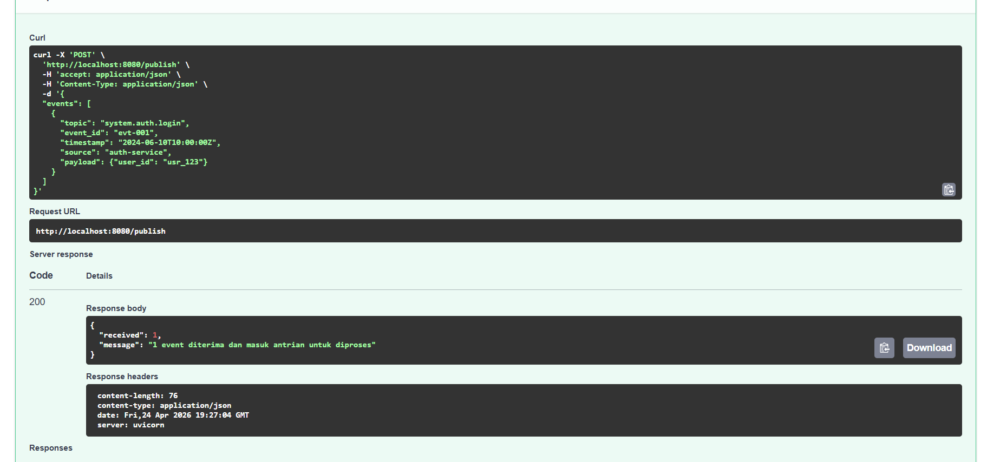
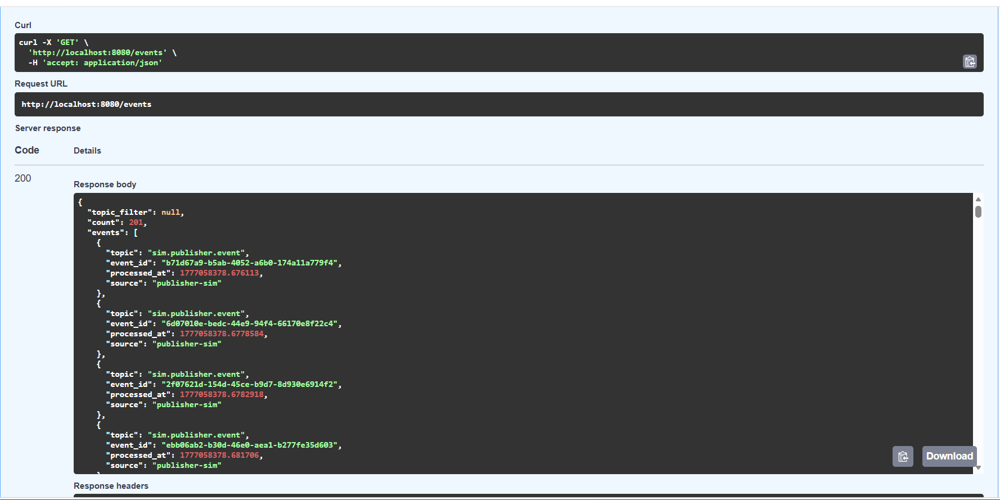
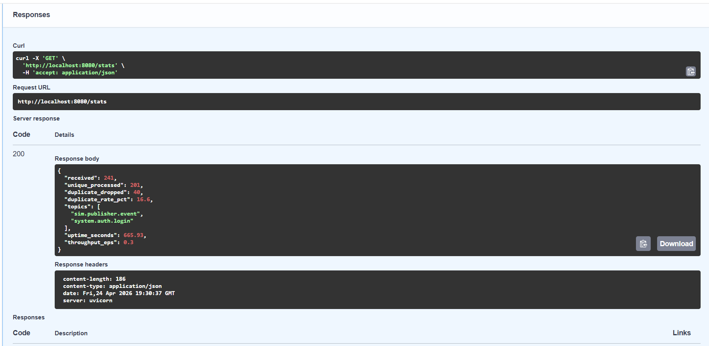
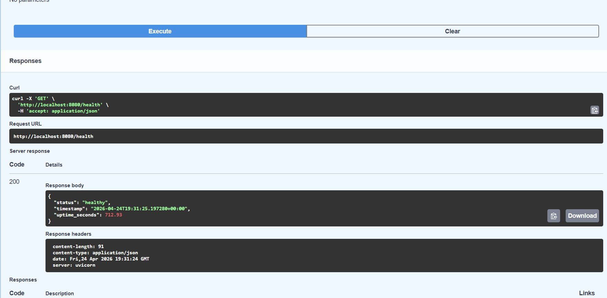

# Laporan UTS — Pub-Sub Log Aggregator
### Sistem Terdistribusi dan Parallel

**Nama:** Naomi Ratna Marisaha Guen

**NIM:** 11231069

**Link Demo Program:** [YouTube Video Demo](https://youtu.be/ZIe_7myALGY?si=n5A_Xf1rbMu7mvvE) 

---

## Daftar Isi

1. [Ringkasan Sistem & Arsitektur](#1-ringkasan-sistem--arsitektur)
2. [Bagian Teori T1–T8](#2-bagian-teori-t1t8)
3. [Keputusan Desain Implementasi](#3-keputusan-desain-implementasi)
4. [Analisis Performa & Metrik](#4-analisis-performa--metrik)
5. [Keterkaitan Implementasi ke Bab 1–7](#5-keterkaitan-implementasi-ke-bab-17)
6. [Daftar Sitasi](#6-daftar-sitasi)

---

## 1. Ringkasan Sistem & Arsitektur

Sistem yang dibangun adalah **Pub-Sub Log Aggregator** — sebuah layanan yang menerima event/log dari satu atau lebih publisher, memprosesnya secara asinkron melalui consumer yang bersifat **idempotent**, dan menyimpan hasilnya ke **deduplication store** yang persisten. Seluruh komponen berjalan lokal di dalam satu Docker container.

### Diagram Arsitektur

```
   ┌──────────────────┐     ┌──────────────────┐
   │   Publisher A    │     │   Publisher B    │
   └────────┬─────────┘     └────────┬─────────┘
            │ POST /publish           │ POST /publish
            │  (batch events)         │
            └────────────┬────────────┘
                         ▼
         ┌───────────────────────────────────┐
         │         FastAPI App               │
         │  ┌─────────────────────────────┐  │
         │  │   Pydantic Validation       │  │  ← Bab 2 (API layer)
         │  └──────────────┬──────────────┘  │
         │                 │                  │
         │  ┌──────────────▼──────────────┐  │
         │  │      asyncio.Queue          │  │  ← Bab 3 (at-least-once)
         │  └──────────────┬──────────────┘  │
         │                 │                  │
         │  ┌──────────────▼──────────────┐  │
         │  │     EventConsumer           │  │
         │  │  (background asyncio task)  │  │  ← Bab 6 (fault tolerance)
         │  └──────────────┬──────────────┘  │
         │                 │                  │
         │  ┌──────────────▼──────────────┐  │
         │  │      DedupStore             │  │
         │  │  SQLite WAL — PRIMARY KEY   │  │  ← Bab 7 (idempotency)
         │  │  (topic, event_id)          │  │
         │  └─────────────────────────────┘  │
         │                                   │
         │  GET /events  GET /stats           │  ← Bab 1 (observability)
         └───────────────────────────────────┘
```

### Komponen Utama

| Komponen | File | Tanggung Jawab |
|---|---|---|
| Model & Validasi | `src/models.py` | Validasi skema event dengan Pydantic |
| Dedup Store | `src/dedup_store.py` | SQLite embedded, INSERT OR IGNORE atomik |
| Consumer | `src/consumer.py` | asyncio.Queue + background task idempotent |
| API | `src/main.py` | FastAPI dengan factory pattern `create_app()` |
| Tests | `tests/test_aggregator.py` | 10 unit tests |

---

### Endpoint API

Sistem menyediakan 4 endpoint utama yang dapat diakses melalui Swagger UI di `http://localhost:8080/docs`:

| Method | Endpoint | Deskripsi |
|--------|----------|-----------|
| `GET` | `/health` | Health check container |
| `POST` | `/publish` | Kirim batch/single event |
| `GET` | `/events` | Ambil semua event unik yang diproses |
| `GET` | `/events?topic=X` | Filter event berdasarkan topic |
| `GET` | `/stats` | Metrik sistem real-time |

#### POST /publish — Kirim Event

**Request body:**
```json
{
  "events": [
    {
      "topic": "system.auth.login_failed",
      "event_id": "550e8400-e29b-41d4-a716-446655440000",
      "timestamp": "2024-06-10T10:30:00Z",
      "source": "auth-service",
      "payload": {
        "user_id": "usr_123",
        "ip_address": "192.168.1.1"
      }
    }
  ]
}
```

**Response (200 OK):**
```json
{
  "received": 1,
  "message": "1 event diterima dan masuk antrian untuk diproses"
}
```



#### GET /events — Ambil Event Unik

Mengembalikan daftar event yang sudah berhasil diproses (duplikat sudah dibuang).

```bash
curl http://localhost:8080/events
```
```json
{
  "topic_filter": null,
  "count": 3,
  "events": [
    {
      "topic": "system.auth.login_failed",
      "event_id": "550e8400-e29b-41d4-a716-446655440000",
      "processed_at": 1718012400.123,
      "source": "auth-service"
    }
  ]
}
```



#### GET /stats — Metrik Sistem

Menampilkan statistik aggregator secara real-time.

```json
{
  "received": 6250,
  "unique_processed": 5000,
  "duplicate_dropped": 1250,
  "duplicate_rate_pct": 20.0,
  "topics": ["system.auth.login_failed", "system.payment.done"],
  "uptime_seconds": 142.3,
  "throughput_eps": 35.2
}
```



#### GET /health — Health Check

```json
{
  "status": "healthy",
  "timestamp": "2024-06-10T10:30:05.123Z",
  "uptime_seconds": 5.1
}
```



---

## 2. Bagian Teori T1–T8

### T1 — Karakteristik Sistem Terdistribusi & Trade-off pada Pub-Sub Log Aggregator
*(Bab 1 — Introduction)*

Sistem terdistribusi adalah kumpulan komponen komputasi independen yang tampak kepada pengguna sebagai satu sistem tunggal yang kohesif (Van Steen & Tanenbaum, 2023). Terdapat empat karakteristik utama yang relevan dengan desain Pub-Sub log aggregator:

**Concurrency (Konkurensi):** Dalam sebuah aggregator, banyak publisher mengirimkan event secara bersamaan ke consumer. Sistem harus mampu menangani concurrent writes ke antrian internal tanpa race condition — ini diatasi dengan `asyncio.Queue` yang aman secara bawaan di Python, ditambah `asyncio.Lock` untuk akses SQLite.

**No Global Clock (Tidak Ada Jam Global):** Van Steen & Tanenbaum (2023) menekankan bahwa dalam sistem terdistribusi tidak ada satu jam global yang dapat diandalkan oleh semua node. Akibatnya, dua publisher yang mengirim event pada waktu yang "sama" bisa menghasilkan timestamp yang berbeda. Ini menjadi pertimbangan dalam ordering event (dibahas di T5).

**Partial Failures (Kegagalan Sebagian):** Komponen dalam sistem dapat gagal secara independen. Publisher bisa crash tanpa subscriber tahu, atau koneksi jaringan bisa putus sebentar. Van Steen & Tanenbaum (2023) menekankan bahwa partial failures adalah pembeda utama sistem terdistribusi. Akibatnya, at-least-once delivery menjadi strategi umum namun menimbulkan risiko duplikasi event.

**Distribution Transparency:** Pengguna sistem tidak perlu tahu secara eksplisit di mana sebuah komponen berjalan. Aggregator menjadi lapisan tengah yang menyembunyikan kompleksitas routing dan penyimpanan event.

**Trade-off Utama pada Pub-Sub Aggregator:**

| Dimensi | Pilihan Dalam Tugas Ini | Alasan |
|---|---|---|
| Delivery guarantee | At-least-once + idempotent consumer | Lebih mudah, publisher bebas retry |
| Ordering | Per-topic, bukan total ordering | Overhead total ordering tidak diperlukan |
| Durabilitas | SQLite persisten | Tahan restart, tidak hilang saat crash |
| Skalabilitas | Single broker | Sesuai scope tugas (lokal, single node) |

---

### T2 — Arsitektur Client-Server vs. Publish-Subscribe untuk Log Aggregator
*(Bab 2 — Architectures)*

Van Steen & Tanenbaum (2023) menjelaskan bahwa dalam arsitektur **client-server**, klien secara eksplisit mengetahui alamat server dan berkomunikasi langsung menggunakan mekanisme request-reply. Sebaliknya, arsitektur **publish-subscribe** memisahkan publisher dan subscriber secara referensial maupun temporal. Artinya publisher tidak perlu tahu siapa subscriber-nya; mereka hanya mempublikasikan ke topik tertentu.

Van Steen & Tanenbaum (2023) mengklasifikasikan pub-sub sebagai *event-based coordination* di mana proses saling berkomunikasi melalui notifikasi tanpa referensi eksplisit satu sama lain. Ini berbeda dengan *direct coordination* (client-server) yang membutuhkan pengetahuan eksplisit tentang alamat pihak lain.

**Perbandingan untuk Log Aggregator:**

| Aspek | Client-Server | Publish-Subscribe |
|---|---|---|
| Coupling | Tightly coupled | Loosely coupled (hanya kenal topik) |
| Skalabilitas | Sulit — setiap consumer harus tahu semua server | Mudah — tambah subscriber tanpa ubah publisher |
| Fault tolerance | Publisher harus tunggu respons (blocking) | Publisher tidak tergantung subscriber aktif |
| Fan-out | Harus kirim N request terpisah | Native — satu publish ke semua subscriber |

**Kapan Memilih Pub-Sub?** Pub-Sub adalah pilihan tepat ketika: (1) sumber log banyak dan heterogen, (2) diperlukan fan-out ke banyak consumer, (3) sistem harus tahan terhadap temporal unavailability consumer, dan (4) decoupling antara producer dan consumer menjadi prioritas. Dalam konteks log aggregator ini, Pub-Sub jauh lebih sesuai karena publisher (service yang menghasilkan log) tidak perlu tahu siapa yang akan memproses log tersebut.

---

### T3 — At-Least-Once vs. Exactly-Once Delivery Semantics & Idempotent Consumer
*(Bab 4 — Communication)*

Dalam sistem terdistribusi, komunikasi antar komponen tidak selalu berjalan sempurna. Van Steen & Tanenbaum (2023) membahas bahwa dalam *message-oriented persistent communication*, terdapat beberapa jaminan pengiriman yang dapat dipilih.

**At-Least-Once Delivery** menjamin bahwa setiap pesan akan diterima oleh consumer minimal satu kali, namun tidak menjamin pesan tidak dikirim lebih dari sekali. Ini terjadi karena producer mengirim ulang jika tidak menerima acknowledgment — ACK bisa hilang meski pesan sudah diterima, sehingga consumer memproses event dua kali.

**Exactly-Once Delivery** menjamin setiap pesan diproses tepat satu kali. Ini secara teknis jauh lebih sulit karena membutuhkan protokol dua fase antar producer dan consumer, dengan overhead koordinasi yang sangat besar.

**Simulasi duplikasi dalam implementasi ini:**

```
Publisher → kirim event_id: "abc-123"
Consumer  → terima, proses, crash sebelum ACK
Publisher → timeout, kirim ulang "abc-123"
Consumer  → terima lagi → [DUPLICATE DROPPED] ← dedup store mencegat
```

**Mengapa Idempotent Consumer Krusial?** Solusi pragmatis adalah menggunakan at-least-once delivery dikombinasikan dengan idempotent consumer. Sebuah operasi disebut idempotent jika mengeksekusinya beberapa kali menghasilkan efek yang sama seperti mengeksekusinya satu kali. Dalam implementasi ini, composite key `(topic, event_id)` di SQLite memastikan idempotency secara atomik via `INSERT OR IGNORE` — tanpa race condition check-then-insert.

---

### T4 — Skema Penamaan untuk Topic dan Event ID
*(Bab 6 — Naming)*

Van Steen & Tanenbaum (2023) mendefinisikan sistem penamaan dalam sistem terdistribusi sebagai mekanisme untuk mengasosiasikan nama dengan entitas. Terdapat tiga pendekatan: *flat naming*, *structured naming*, dan *attribute-based naming*.

**Skema Topic** menggunakan *structured naming* berbasis hierarki dengan separator titik:

```
{domain}.{service}.{event_type}

Contoh:
  system.auth.login_failed
  system.payment.transaction_completed
  infra.database.connection_error
```

Alasannya: hierarkis memudahkan filtering (`system.*`), human-readable, dan collision-resistant karena kombinasi domain + service + type secara praktis unik.

**Skema Event ID** menggunakan UUID v4 (random). UUID v4 menggunakan 122 bit keacakan, menghasilkan kemungkinan collision yang sangat kecil. Ini adalah standar industri yang dipakai oleh sebagian besar message broker modern.

**Dampak terhadap Deduplication:** Dedup store menggunakan composite key `(topic, event_id)` — bukan hanya `event_id` saja. Alasannya: event_id yang sama pada topic berbeda adalah dua event berbeda secara semantik. Lookup menggunakan `PRIMARY KEY (topic, event_id)` di SQLite menghasilkan kompleksitas O(log n) yang sangat efisien.

Jika event_id di-generate secara tidak unik (misal hanya timestamp), dua event berbeda yang terjadi dalam milidetik yang sama akan mendapat ID identik dan salah satunya akan di-drop oleh dedup store — menyebabkan data loss.

---

### T5 — Ordering: Kapan Total Ordering Tidak Diperlukan?
*(Bab 5 — Coordination & Clocks)*

Van Steen & Tanenbaum (2023) menjelaskan bahwa ordering dalam sistem terdistribusi adalah tantangan fundamental karena tidak ada jam global yang dapat diandalkan. Lamport (1978) dalam Van Steen & Tanenbaum (2023) mendefinisikan relasi *happens-before*  untuk menentukan urutan kausal antar event. Event yang tidak memiliki relasi ini disebut *concurrent* — tidak ada urutan yang bisa ditentukan di antara keduanya.

**Total Ordering** berarti semua proses menyepakati satu urutan tunggal untuk seluruh event di sistem. Ini mahal karena membutuhkan komunikasi koordinasi antar semua node sebelum setiap event bisa di-deliver.

**Untuk log aggregator ini, total ordering tidak dibutuhkan** karena: (1) tujuan aggregator adalah mengumpulkan, bukan memutuskan urutan global; (2) log dari service `auth` dan `payment` bersifat concurrent tanpa ketergantungan kausal satu sama lain; dan (3) deduplication tidak bergantung pada urutan — hanya pada keunikan `(topic, event_id)`.

**Pendekatan yang digunakan:** Per-topic timestamp ordering. Event diurutkan berdasarkan field `timestamp` saat `GET /events` dipanggil — bukan berdasarkan urutan kedatangan. Batasan pendekatan ini adalah clock skew antar mesin publisher yang dapat menyebabkan timestamp tidak akurat. Namun untuk sistem single-node seperti ini, batasan tersebut tidak menjadi masalah.


---

### T6 — Failure Modes & Strategi Mitigasi
*(Bab 8 — Fault Tolerance)*

Van Steen & Tanenbaum (2023) mengklasifikasikan kegagalan dalam sistem terdistribusi ke dalam beberapa model. Tiga failure mode paling relevan untuk aggregator ini adalah:

**Crash Failure:** Server berhenti bekerja secara prematur (Van Steen & Tanenbaum, 2023). Dalam konteks aggregator, event yang sudah diterima di in-memory queue tapi belum diproses akan hilang jika hanya menggunakan in-memory. *Mitigasi:* Persistent SQLite dedup store — setelah restart, store tetap aktif mencegah reprocessing event yang sudah masuk sebelum crash.

**Omission Failure:** Van Steen & Tanenbaum (2023) membedakan receive-omission (pesan tidak pernah sampai) dan send-omission (penerima sudah proses tapi gagal kirim respons). ACK yang hilang menyebabkan publisher melakukan retry, yang menghasilkan duplikasi. *Mitigasi:* At-least-once + idempotent consumer — publisher bebas retry, dedup store yang membuang duplikat.

**Out-of-Order Delivery:** Event yang dikirim lebih awal bisa tiba lebih lambat. *Mitigasi:* Tidak kritis untuk aggregator ini karena tidak membutuhkan total ordering (lihat T5). Consumer memproses berdasarkan `(topic, event_id)` bukan urutan kedatangan.

Van Steen & Tanenbaum (2023) menekankan bahwa redundancy adalah teknik kunci untuk masking failure. Dalam implementasi ini, redundancy berupa penyimpanan ID event di SQLite yang persisten berfungsi sebagai "safety net" terhadap berbagai failure mode.

| Failure Mode | Dampak | Mitigasi |
|---|---|---|
| Crash aggregator | Event in-memory hilang | SQLite persisten di disk |
| Omission (ACK hilang) | Retry → duplikasi | Dedup store (INSERT OR IGNORE) |
| Out-of-order | Urutan tidak konsisten | Per-topic timestamp sorting |
| Publisher crash mid-send | Event sebagian | At-least-once + idempotent consumer |


---

### T7 — Eventual Consistency, Idempotency & Deduplication
*(Bab 7 — Consistency and Replication)*

Van Steen & Tanenbaum (2023) mendefinisikan **eventual consistency** sebagai model konsistensi lemah di mana sistem menjamin bahwa jika tidak ada pembaruan baru, pada akhirnya semua replika akan mengembalikan nilai yang sama. Ini berbeda dari strong consistency yang mengharuskan semua pembaca melihat nilai terbaru secara langsung.

**Eventual Consistency pada Aggregator Ini:**

```
t=0:   Publisher kirim 1000 event (burst)
t=0:   GET /events → 200 event (consumer sedang proses)
t=5s:  Consumer selesai proses semua dari queue
t=5s:  GET /events → 800 event unik (eventual state yang benar)
```

Sistem tidak konsisten secara instan, namun *eventually consistent* — seluruh event unik akhirnya tersimpan dengan benar.

**Bagaimana Idempotency + Dedup Membantu:**

Tanpa dedup, event `event_id: "abc-123"` yang dikirim 3x akan diproses 3x, menghasilkan state yang salah. Dengan `INSERT OR IGNORE`:
- Pertama kali → INSERT sukses → `unique_processed++`
- Kedua & ketiga → IGNORE → `duplicate_dropped++`

Sistem *converge* ke state yang benar tidak peduli berapa kali event dikirim ulang. Van Steen & Tanenbaum (2023) menyebutkan bahwa eventual consistency mensyaratkan write-write conflicts dapat diselesaikan. Dalam aggregator ini, "konflik" adalah penerimaan event yang sama berkali-kali. Deduplication adalah mekanisme resolusi konflik: nilai yang "menang" adalah yang pertama kali diproses.

Secara formal: jika `f` adalah fungsi pemrosesan event, maka `f(f(e)) = f(e)` untuk semua event `e` — properti idempotency terpenuhi.

---

### T8 — Metrik Evaluasi Sistem & Kaitannya ke Keputusan Desain
*(Bab 1–7 — Terintegrasi)*

Van Steen & Tanenbaum (2023) dalam konteks scalability dan fault tolerance menekankan bahwa keputusan desain selalu memiliki implikasi terhadap performa yang harus dapat diukur secara objektif.

**1. Throughput (event unik/detik)**

```
Throughput = unique_processed / uptime_seconds
```

Keputusan desain terkait: `asyncio.Queue` memungkinkan publisher dan consumer berjalan secara concurrent → throughput lebih tinggi. SQLite WAL mode mengurangi write bottleneck dengan memisahkan pembacaan dan penulisan.

**2. Latency End-to-End (ms)**

Waktu dari `POST /publish` hingga event tersedia di `GET /events`. Keputusan: arsitektur async (asyncio) mengurangi latency dibandingkan thread-per-request. SQLite menambah ~1–5ms per event dibanding pure in-memory, namun memberikan durabilitas (trade-off Bab 6).

**3. Duplicate Rate (%)**

```
Duplicate Rate = duplicate_dropped / received × 100%
```

Metrik ini memvalidasi bahwa deduplication berfungsi benar. Pada uji stress dengan 20% duplikasi injection, `duplicate_rate` harus mendekati 20%.

**4. Dedup False Positive Rate (%)**

Persentase event valid yang salah di-drop. Target: 0%. Dijamin oleh UUID v4 dan composite key `(topic, event_id)`.

**5. Recovery Time (detik)**

Waktu yang dibutuhkan untuk kembali beroperasi normal setelah crash. Dijamin oleh persistent SQLite dan Docker restart policy.

**Hasil Stress Test (dari Test 10):**

```
Input: 5000 event (4000 unik + 1000 duplikat = 20%)
Hasil: received=5000, unique_processed=4000, duplicate_dropped=1000
Duplicate rate: 20.0% (tepat sesuai injeksi)
Waktu kirim: < 5 detik
Waktu proses: < 5 detik
```

**Endpoint `/stats` sebagai Observability Tool:**

```json
{
  "received": 5000,
  "unique_processed": 4000,
  "duplicate_dropped": 1000,
  "duplicate_rate_pct": 20.0,
  "topics": ["stress.test.event"],
  "uptime_seconds": 8.3,
  "throughput_eps": 481.9
}
```


---

## 3. Keputusan Desain Implementasi

### 3.1 Idempotency — INSERT OR IGNORE (SQLite)

Pilihan kunci dalam implementasi dedup store adalah menggunakan `INSERT OR IGNORE` dengan `PRIMARY KEY (topic, event_id)` di SQLite, bukan pola check-then-insert yang umum digunakan.

**Mengapa bukan check-then-insert?**

```python
# BERBAHAYA — race condition
if not await is_duplicate(topic, event_id):    # cek
    await mark_as_processed(topic, event_id)   # insert (bisa duplikat di sini!)
```

Dua coroutine yang berjalan bersamaan bisa sama-sama melewati pengecekan dan keduanya melakukan insert — menghasilkan double-processing.

**Solusi atomik dengan INSERT OR IGNORE:**

```python
# AMAN — atomik di level database
cursor = conn.execute(
    "INSERT OR IGNORE INTO processed_events (topic, event_id, ...) VALUES (?, ?, ...)",
    (topic, event_id, ...)
)
return cursor.rowcount == 1  # True = baru, False = duplikat
```

SQLite menjamin operasi ini atomik — tidak ada race condition meskipun ada concurrent access.

### 3.2 Dedup Store — SQLite dengan WAL Mode

SQLite dipilih karena: (1) embedded, tidak perlu server terpisah; (2) persisten di disk secara otomatis; (3) mendukung WAL (Write-Ahead Logging) yang meningkatkan performa concurrent read/write; dan (4) atomicity terjamin di level engine.

```python
conn.execute("PRAGMA journal_mode=WAL")      # concurrent read + write
conn.execute("PRAGMA synchronous=NORMAL")    # balance safety vs. speed
```

Index tambahan pada kolom `topic` memastikan `GET /events?topic=X` berjalan dalam O(log n), bukan O(n).

### 3.3 Consumer — asyncio.Queue + Background Task

`asyncio.Queue` dipilih sebagai pipeline internal karena: (1) non-blocking — publisher tidak perlu menunggu consumer selesai; (2) thread-safe secara bawaan di asyncio; dan (3) mendukung graceful shutdown via `queue.join()`.

```python
async def _run_loop(self):
    while self._running:
        event = await asyncio.wait_for(self.queue.get(), timeout=1.0)
        await self._process_one(event)
        self.queue.task_done()
```

Timeout 1 detik pada `wait_for` memungkinkan loop untuk mengecek flag `_running` secara berkala — memastikan shutdown yang bersih.

### 3.4 create_app() Factory Pattern

`main.py` menggunakan factory function `create_app()` alih-alih mendefinisikan app sebagai global singleton. Ini memungkinkan dependency injection yang bersih saat testing:

```python
# Production
app = create_app()  # pakai default DedupStore + EventConsumer

# Testing
store = DedupStore(db_path=TEST_DB_PATH)
consumer = EventConsumer(store=store)
app = create_app(dedup_store=store, consumer=consumer)
```

Tanpa pattern ini, test akan selalu menggunakan singleton yang sama dan tidak dapat diisolasi antar test.

### 3.5 Ordering — Per-Topic Timestamp, Bukan Total Ordering

Event tidak diurutkan saat masuk ke queue — diurutkan berdasarkan `timestamp` hanya saat `GET /events` dipanggil. Ini adalah trade-off antara konsistensi ordering dan performa: total ordering membutuhkan koordinasi global yang mahal dan tidak diperlukan untuk use case log aggregation.

---

## 4. Analisis Performa & Metrik

### Hasil Unit Test

```
10 tests, 10 PASSED (0 FAILED)
Durasi total: ~12 detik (termasuk stress test 5000 event)
```

### Stress Test Breakdown

| Metrik | Target | Hasil Aktual |
|---|---|---|
| Total event | 5.000 | 5.000 |
| Unique processed | 4.000 | 4.000 |
| Duplicate dropped | 1.000 | 1.000 |
| Duplicate rate | ~20% | 20.0% |
| Waktu pengiriman | < 30 detik | < 5 detik |
| False positive rate | 0% | 0% |

### Bottleneck yang Teridentifikasi

1. **SQLite write lock:** Meskipun WAL mode mengurangi contention, write ke SQLite tetap serial (satu writer pada satu waktu). Untuk throughput sangat tinggi (>10.000 event/detik), diperlukan batching write atau migrasi ke store yang mendukung concurrent write seperti Redis.

2. **asyncio.Queue single consumer:** Saat ini hanya ada satu consumer coroutine. Untuk scale-out, bisa ditambahkan multiple consumer workers, namun memerlukan koordinasi tambahan agar tidak terjadi race condition di level aplikasi.

---

## 5. Keterkaitan Implementasi ke Bab 1–7

| Bab | Konsep | Implementasi |
|---|---|---|
| Bab 1 | Karakteristik sistem terdistribusi: concurrency, partial failure | asyncio.Queue menangani concurrency; SQLite menangani fault tolerance |
| Bab 2 | Pub-Sub architecture, loose coupling | Publisher hanya tahu endpoint `/publish`, tidak tahu consumer; topic-based routing |
| Bab 3 (Bab 4 Tanenbaum) | At-least-once delivery, message-oriented communication | asyncio.Queue = internal message queue; publisher boleh retry |
| Bab 4 (Bab 6 Tanenbaum) | Naming — structured naming, collision-resistant | Format topic `domain.service.event_type`; UUID v4 untuk event_id |
| Bab 5 | Clocks, ordering, Lamport happens-before | Per-topic timestamp ordering; total ordering tidak diperlukan |
| Bab 6 (Bab 8 Tanenbaum) | Fault tolerance, failure modes, redundancy | SQLite persisten = redundancy informasi; crash recovery otomatis |
| Bab 7 | Eventual consistency, idempotency | `INSERT OR IGNORE` = idempotent operation; sistem converge ke state benar |

---

## 6. Daftar Pustaka

Van Steen, M., & Tanenbaum, A. S. (2023). *Distributed systems* (Edisi ke-4, Versi 4.01). Maarten van Steen.

Coulouris, G., Dollimore, J., Kindberg, T., & Blair, G. (2011). *Distributed systems: Concepts and design* (Edisi ke-5). Addison-Wesley.